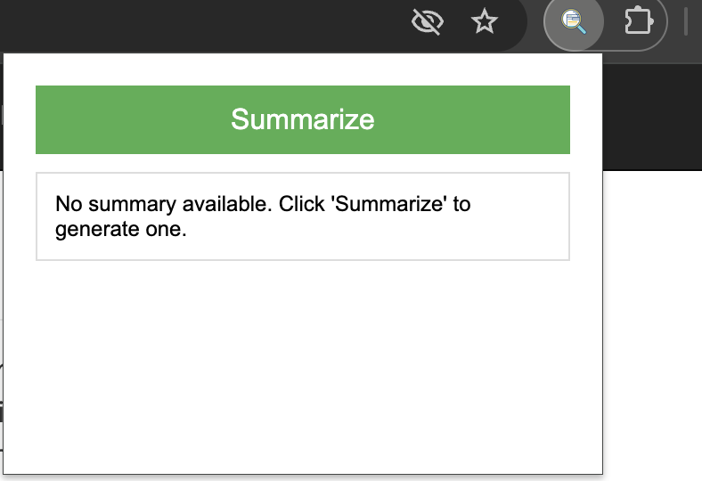
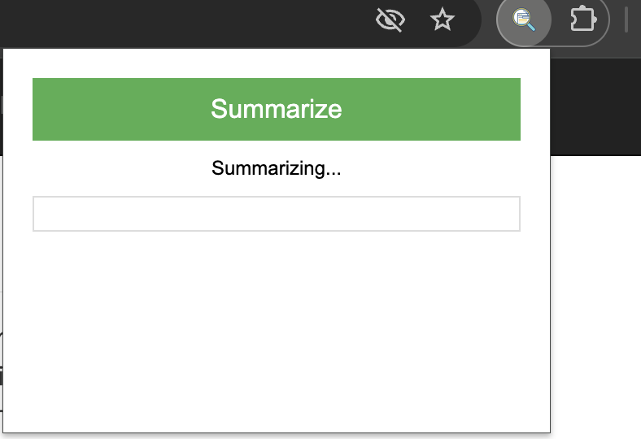
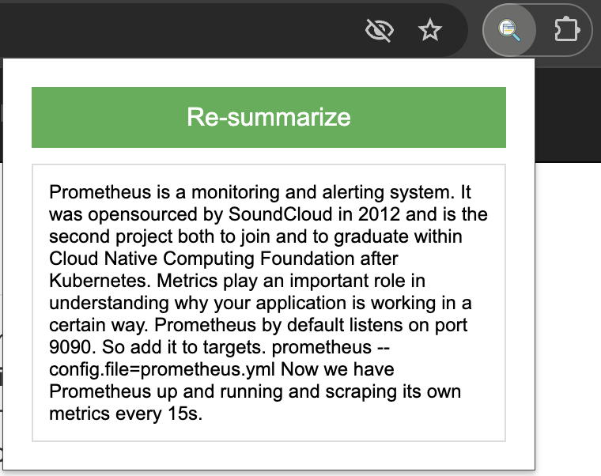

# Web Page Summarizer Chrome Extension

## Overview

This Chrome extension uses AI to summarize web page content, providing quick and concise summaries of articles, blog posts, and other web content. It leverages the Hugging Face API to generate summaries, making it easy to grasp the main points of a webpage without reading the entire content.

## Features

- Summarizes web page content with a single click
- Uses advanced AI models for accurate summarization
- Saves summaries for each tab, allowing you to switch between tabs without losing summaries
- Provides a "Re-summarize" option for updated content

## Installation

1. Clone this repository or download the source code.
2. Open Google Chrome and navigate to `chrome://extensions/`.
3. Enable "Developer mode" in the top right corner.
4. Click "Load unpacked" and select the directory containing the extension files.

## Setting up the Hugging Face API Key

1. Go to [Hugging Face](https://huggingface.co/) and create an account if you don't have one.
2. Navigate to your profile settings and find the "Access Tokens" section.
3. Create a new token with read access.
4. Copy the generated API key.
5. Open the `popup.js` file in the extension directory.
6. Replace `YOUR_HUGGING_FACE_API_TOKEN` with your actual API key:

## Usage

1. Navigate to a web page you want to summarize.
2. Click on the extension icon in your Chrome toolbar.
3. In the popup, click the "Summarize" button.

4. Wait for the AI to generate a summary (this may take a few seconds).

5. Read the generated summary in the popup.

If you switch to a different tab and come back, the extension will remember the previous summary. You can click "Re-summarize" if you want to generate a new summary for updated content.

## How It Works

1. When you click "Summarize," the extension extracts the main text content from the current web page.
2. The content is sent to the Hugging Face API, which uses an AI model to generate a concise summary.
3. The summary is displayed in the extension popup and saved for that specific tab.
4. If the content is too long, it's split into chunks and summarized in parts.

## Troubleshooting

- If you encounter any issues, make sure your Hugging Face API key is correctly set in the `popup.js` file.
- Check that you have an active internet connection, as the extension requires access to the Hugging Face API.
- If summaries are not generating, try reloading the extension in the Chrome extensions page.

## Contributing

Contributions are welcome! Please feel free to submit a Pull Request.

## License

This project is open source and available under the [MIT License](LICENSE).
